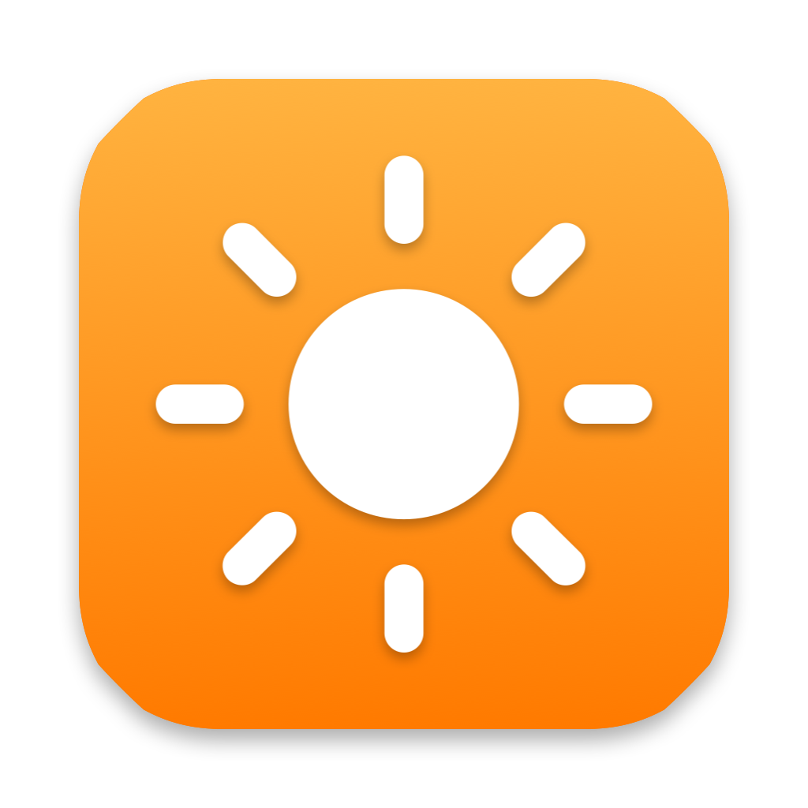

# BrightBar



**Control external monitor brightness, contrast, volume and input from the macOS menu bar.** DDC/CI for Apple Silicon Macs, with keyboard brightness keys, sync with the built-in display, sunrise/sunset scheduling, presets, a CLI, and software dimming below the monitor's minimum.

Free, open source, native Swift, no Dock icon, no dependencies.

## Features

- **Brightness, contrast, volume, mute** for external monitors over DDC/CI (DisplayPort, USB-C, Thunderbolt, HDMI\*)
- **Input switching** (HDMI / DisplayPort / USB-C) — share one monitor between a Mac and another machine
- **Keyboard brightness and volume keys** control whichever monitor the cursor is on, with the native macOS bezel
- **Sync with built-in display** — externals follow the MacBook's ambient-light-driven brightness through a per-monitor offset and curve
- **Schedule** — sunrise/sunset or fixed times, smooth ramps, presets (Day / Evening / Night)
- **Global hotkeys**, scroll wheel on the menu bar icon, ⇧⌥ for 1 % steps
- **Software dimming** below 0 % for monitors whose minimum is still too bright
- **Restores your levels** on wake and reconnect, remembered per monitor
- **`brightbar` CLI** and **`brightbar://` URL scheme** for Shortcuts, Raycast, Alfred, Keyboard Maestro
- Apple Studio Display / Pro Display XDR / LG UltraFine supported via native brightness; experimental Intel Mac support
- Control Center–style popover, Settings window, Launch at Login, diagnostics report

## Install

```bash
git clone https://github.com/suprasannaojha/brightbar && cd brightbar
./scripts/install.sh        # builds, copies to /Applications, opens the app
```

Or with Homebrew: `brew install --cask ./Casks/brightbar.rb`

Requires an Apple Silicon Mac on macOS 13+. On first launch grant **Accessibility** access (System Settings → Privacy & Security) so the brightness keys can be intercepted. Everything else is in **Settings** (gear icon in the popover or right-click the menu bar icon).

## Command line

```bash
brightbar list                    # displays, capabilities, current levels
brightbar set 40                  # brightness; -20 = software dimming; +10 / +-10 relative
brightbar set --property contrast 50
brightbar input hdmi1 --display 1
brightbar mute toggle
brightbar preset Night
brightbar probe                   # DDC/CI diagnostics
```

URL scheme: `brightbar://set?brightness=40`, `brightbar://adjust?brightness=+10`, `brightbar://preset/Night`, `brightbar://input?source=dp1`, `brightbar://mute?state=toggle`.

Install the command from Settings → General, or `ln -s /Applications/BrightBar.app/Contents/MacOS/BrightBar /usr/local/bin/brightbar`.

## Troubleshooting

- Turn on **DDC/CI** in your monitor's on-screen menu.
- Some docks, hubs and KVMs don't forward DDC; try a direct cable. \*HDMI on some Macs does not carry DDC.
- Monitor too bright at 0 %? Slide below 0 for software dimming, or set a usable range per monitor in Settings → Displays.
- `brightbar probe` (or Settings → General → Copy diagnostics) shows exactly what the app detects — include it in bug reports.

## How it works

Apple Silicon Macs expose each display's I²C bus through the private `IOAVService` IOKit API; BrightBar speaks MCCS/VCP over it (0x10 luminance, 0x12 contrast, 0x62 volume, 0x8D mute, 0x60 input, 0xD6 power). Apple and LG displays are driven through `DisplayServices`. Software dimming scales the display's gamma table via CoreGraphics and is reverted on quit. Sunrise/sunset uses the NOAA solar algorithm with CoreLocation or a manual coordinate.

## License

MIT
